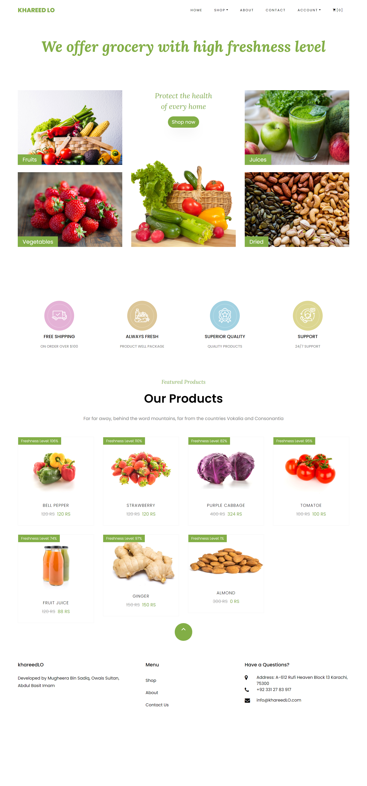

# E-Commerce Grocery Store

## About

Khareed LO is an E-commerce grocery store that aims to take care of shopping needs in a SMART way; making life easier for all customers. The main scope of this application is to sell quality and fresh grocery products in a reasonable amount of money. E-commerce is making millions of revenue from the past two to three years. Your store can earn trust on large marketplaces with huge customer bases, but once you’ve grown to a certain stage. So, it is beneficial to invest money on e-commerce now a days.

The main scope of this application is to sell grocery products which are mentioned below.

<ul>
   <li>Vegetables</li>
   <li>Dried FruitsS</li>
   <li>Fruits</li>
   <li>Juices</li>
</ul>

## Features

Main Features

●	Account management
●	Cart
●	Offers
●	Discounts
●	Admin Panel
●	Freshness level (if the product is not fresh then a decent amount of discount will be given on that particular product)

## Setup

run npm i && npm start
